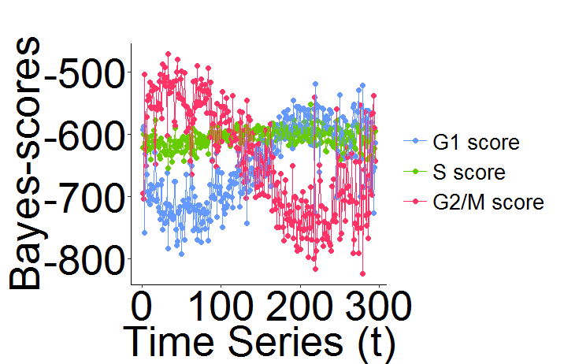
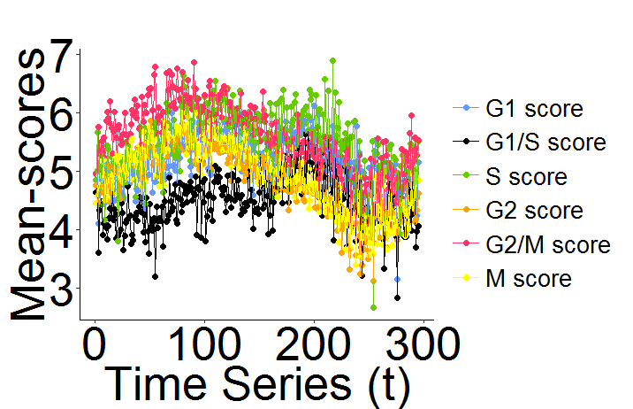
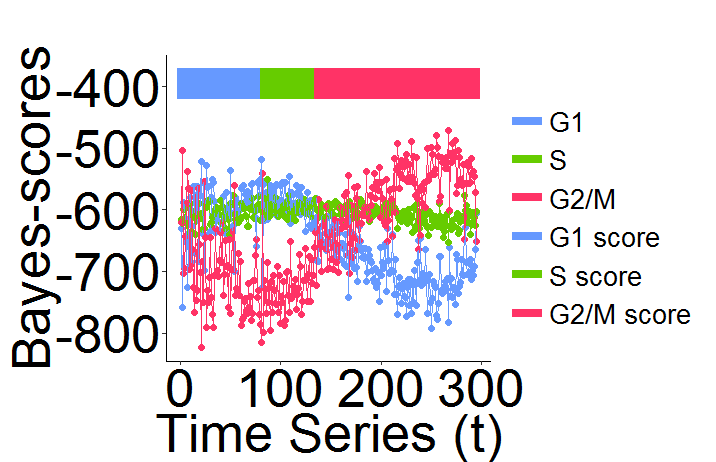
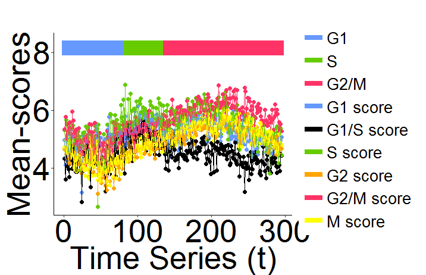

## What is reCAT?

reCAT is a modelling framework for unsynchronized single-cell transcriptome data that can reconstruct a high-resolution cell cycle time-series. It is mainly based on traveling salesman problem (TSP), Gaussian mixture model (GMM) and hidden Markov model (HMM). We developed an R based software package which is easy to use. The performance is relatively accurate and stable. Thanks for using!

Software by Zehua Liu, Huazhe Lou and Hao Wang. reCAT is explained in more detail in the accompanying publication. 

## Philosophy

Two fundamental assumptions underlie the reCAT approach: that 1) different cell cycle phases form a cycle, and 2) the change of transcriptome profile from one phase to the next should be monotonic, increasing with time span widths. 

## Installation

## How to use

reCAT is achieved in R and is easy to use. there are some test data in /data, now we use ola_mES_2i.RData as example.

#### 1.preparatory work

when you use our tool, you should install some packages first, the package list is as follows:

***ggplot2***

***doParallel***

***mclust***

***cluster***

***TSP***

#### 2.data preprocessing

in reCAT, the value in test_exp should be log2(TPM+1), and then you can use ***get_test_exp*** function to get standard input data

	source("get_test_exp.R")
	load("../data/ola_mES_2i.RData")
	test_exp <- get_test_exp(t(test_exp))

in test_exp, there are only cycle base gene's value, we just do a filter on the original data, so that the data is easy to handle in following steps

#### 3.get order (please see * for additional parameters)

When you preprocessing your test data, you can get its order(cell's time series) easily with ***get_ordIndex*** function. In this function, there are two parameters, one is the input data, the other is thread number, the threaad number depends on the number of cores. So maybe you can choose a large thread number like 20 to speed it up when you run it on a server.

for example:

	source("get_ordIndex.R")
	ordIndex <- get_ordIndex(test_exp, 10)

#### 4.get bayes-score and mean-score
In reCAT, there are two scores, bayes score and mean score, you can easily get both when you use ***get_score*** function.

for example:

	source("get_score.R")
	score_result <- get_score(t(test_exp))
you can use the following two orders to view the two scores

	score_result$bayes_score
	score_result$mean_score

#### 5.plot1
Now you have the scores and time series(ordIndex you get before), you can draw the scores along the time series use ***plot*** function

	source("plot.R")
	plot_bayes(score_result$bayes_score, ordIndex)
	plot_mean(score_result$mean_score, ordIndex)
the result is like follows:

#### 6.HMM
Now you have the scores and time series, but you don't know whether the cell is G1 or S or G2/M. In this case, you can use ***get_hmm_order*** function
to sort the cells.

In this function, there are six parameters: bayes_score, mean_score and ordIndex are values you get before. cls_num is class number you want, generally is 3(G1, S, G2/M) or 4(G0, G1, S, G2/M). myord is the real time series that the you can choose, for example, you choose the 4 is the start, and the real order is c(4:1, 295:5). rdata is the class region you judge from the picture you draw before. for example, in ola_mES_2i, we can easily judge cells in c(210:230) is G1, cells in c(40:60) is G2/M, and cells in c(170:190) is S, so the rdata is 

		start	end
	1	210		230
	2	170		190
	3	40		60

for example:
	
	source("get_hmm.R")
	load("../data/ola_mES_2i_ordIndex.RData")
	load("../data/ola_mES_2i_region.RData")
	myord = c(4:1, 295:5)
	hmm_result <- get_hmm_order(bayes_score = score_result$bayes_score, 
		mean_score = score_result$mean_score, 
		ordIndex = ordIndex, cls_num = 3, myord = myord, rdata = rdata)

#### 7.choose the start 
From the example above we can see the paramter "myord" permit choosing start as we like. But how can we now where the real start is? In our tool, you can use ***get_start*** function to get the real start. 

In this function, we go through from 1 to le(le is the whole number of the cell) as start to get hmm result. Everytime we run ***get_hmm_ord*** function, we can get a likelihood, and then we find the maximum likelihood, this is the real start. The paramter nthread is the number of thread you can choose, default is 3. The other paramters is the same as ***get_hmm_ord***.

for example:

	source("get_start.R")
	start = get_start(bayes_score = score_result$bayes_score, 
		mean_score = score_result$mean_score, 
		ordIndex = ordIndex, cls_num = 3, rdata = rdata, nthread = 3)

#### 8.plot2
Now you have the scores, time series and classified information, you can draw these use ***plot*** function

In this function, cls_result is classified information you get in HMM. cls_ord is time series you choose, just like the myord in secetion 6. colorbar is a boolean value, 1 is draw the color bar, 0 is not.
	
	source("plot.R")
	load("../data/ola_mES_2i_hmm.RData")
	plot_bayes(score_result$bayes_score, ordIndex, cls_result = hmm_result, cls_ord = myord, colorbar = 1)
	plot_mean(score_result$mean_score, ordIndex, hmm_result, hmm_order, 1)
the result is like follows:

#### 9.cluster
Our tool can also be used to cluster cells and then find the time series of clustering result.

In section 3, when you run the ***get_ordIndex*** function, you can get a .RData file which record the clustering result. ***get_cluster_result*** function can get a clustering result, scores which are calculated based on the clustering result, and the time series of the clustering result.

for example:

	source("get_cluster_result")
	load("../data/Flo_test_exp.RData")
	load("../data/bestEnsembleComplexTSP 10 - 216 Flo .RData")
	cls_result = get_cluster_result(test_exp = test_exp, ensembleResultLst = ensembleResultLst, 
									resultLst = resultLst, cls_num = 20)

#### * Additional Parameters for get_ordIndex function:
ordIndex <- get_ordIndex(test_exp, threadnum, step_size, base_cycle_range). 

It is trivial that test_exp is your input data and threadnum is the number of cores to use as mentined above. 

The step_size parameter determines the number of k to skip in your consensus path, ie if step_size = 2, then reCAT would only calculate and merge the paths for k = 12, 14, 16, 18, …, n-2, n. We recommend step_size of up to a maximum of 5 while preserving the performance of reCAT. Usually a step_size of 2 (by default) would suffice and bigger steps are recommended for larger datasets (>1000 cells) in order to reduce computational time.

And finally the base_cycle_range is a range of four k’s for computing the reference cycle mentioned in the manuscript. This can be set to 6:9 (by default) or 7:10. 

for example:

	source("get_ordIndex.R")
	load("../data/ola_mES_2i.RData")
	ordIndex <- get_ordIndex(test_exp, threadnum = 10, step_size = 2, base_cycle_range = c(6:9) )
